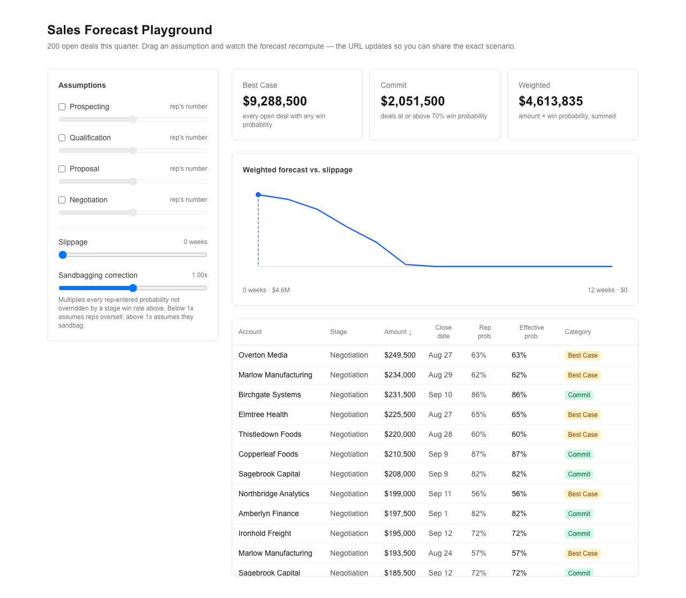
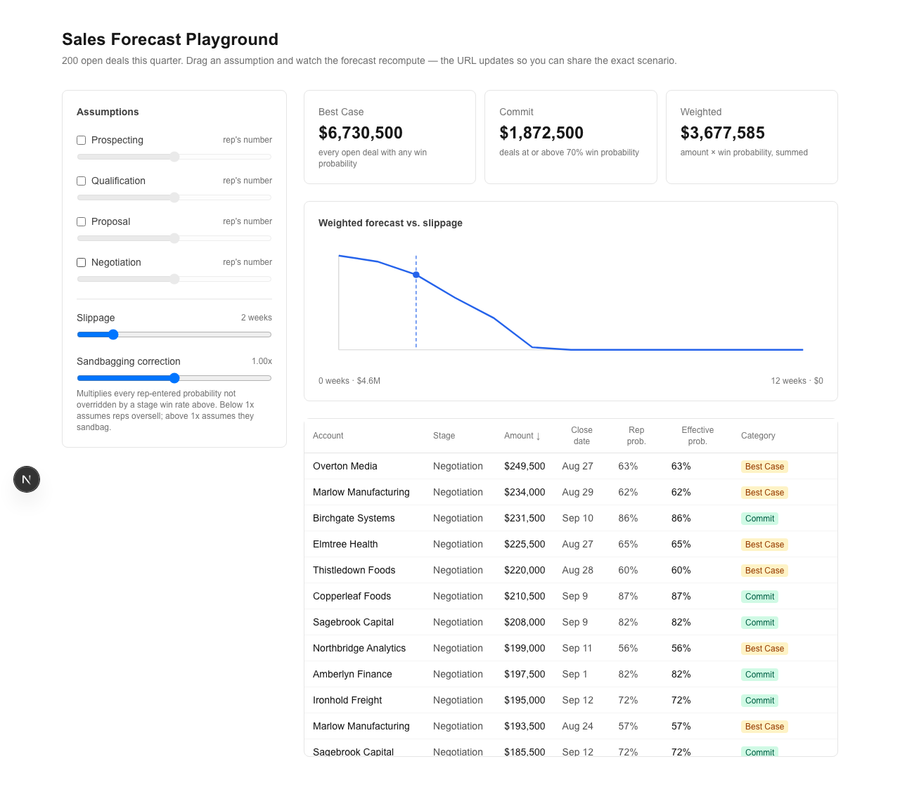

# Sales Forecast Playground

Explore how forecast assumptions — not just deal amounts — move a pipeline's
forecast total.

[Live Demo](https://sales-forecast-playground.vercel.app) · Day 031 of a 100-day building challenge.

## Why I Built This

A sales forecast number is only as good as the assumptions behind it, and
those assumptions are usually invisible. A rep's self-reported probability,
how much deals typically slip past their close date, whether the team is
known to sandbag or oversell — none of that is visible in a single static
forecast total. Nobody can see *how sensitive* the number is to any one
assumption, so forecast conversations become arguments about one opaque
figure instead of an inspection of the inputs that produced it.

## What It Does

200 synthetic open deals across 4 pipeline stages. Three headline numbers —
Best Case, Commit, Weighted — recompute live as you drag any of 6 inputs:
a win-rate override per stage, how many weeks deals typically slip past
their close date, and a sandbagging correction on rep-entered probability.
A sensitivity chart shows the weighted forecast against slippage; the deal
table shows exactly which deals are driving which category, and which have
slipped into next quarter. Every scenario is encoded in the URL, so the
exact assumptions behind a number are one link away.

## Demo

**Default scenario** — headline numbers computed from the pipeline's own
rep-entered probabilities, no assumptions overridden:



**Adjusted scenario** — 2 weeks of slippage dragged in, showing the
sensitivity chart's current position and deals starting to move into next
quarter:



## How It Works

```
lib/types.ts               Deal, Assumptions, stages, quarter/commit constants
lib/forecast.ts             pure functions: effectiveProbability, isInQuarter,
                             computeForecast, computeSensitivity, classifyDeals
lib/generate-deals.ts       one-off seeded generator (not run at runtime)
data/deals.ts                the generated pipeline, committed
app/page.tsx                 URL ⇄ assumptions state, wires the components below
  → app/components/AssumptionControls.tsx   6 sliders
  → app/components/ForecastCards.tsx        Best Case / Commit / Weighted
  → app/components/SensitivityChart.tsx     weighted vs. slippage-weeks
  → app/components/DealTable.tsx            sortable per-deal breakdown
```

Every deal has a rep-entered probability. `effectiveProbability` uses that,
scaled by the sandbagging correction, unless a per-stage win-rate override is
set — in which case the override replaces the rep's number for deals in that
stage. `isInQuarter` slips each deal's close date forward by the slippage
lever and checks it against a fixed quarter-end date; deals that cross it
drop out of every headline total but stay visible in the table, flagged
"moved to next quarter." The quarter's reference date is a constant baked
into the generator, not `Date.now()`, so the deployed demo's numbers never
silently change as real time passes.

## Key Decisions & Tradeoffs

- **Decision:** Deterministic recompute over a fixed pipeline, not a Monte
  Carlo simulation.
  **Why:** A slider that visibly moves 3 numbers is a faster, clearer
  playground than a probabilistic trial run, and the quarter-boundary
  slippage effect is visual enough on its own to make the sensitivity real.
  **Tradeoff:** No confidence interval — the forecast is a point estimate
  per scenario, not a distribution.

- **Decision:** Bottom-up (existing pipeline → forecast under assumptions),
  not top-down (revenue goal → required activity).
  **Why:** [Pipeline Calculator](https://github.com/akshatiwarix/pipeline-calculator)
  (Day 027) already owns the goal-down direction. This repo starts from a
  pipeline that already exists and asks what it forecasts to.
  **Tradeoff:** Doesn't answer "what do I need to hit my number" — only "what
  does what I have forecast to."

- **Decision:** Commit threshold (70% win probability) is a fixed constant,
  not a 7th slider.
  **Why:** Keeps the lever count at 6 and the math legible — a moving
  threshold on top of 6 already-moving assumptions would make the headline
  numbers harder to reason about, not easier.
  **Tradeoff:** A team with a different commit convention can't reproduce
  their own bar without editing `COMMIT_THRESHOLD` in `lib/types.ts`.

- **Decision:** The reference "today" the quarter is scoped to sits deep
  into the quarter (one month from quarter-end), and the dataset's close
  dates cluster near that boundary.
  **Why:** Makes the slippage lever's quarter-boundary cliff visible within
  a small slider range — the whole point of the sensitivity chart.
  **Tradeoff:** Because so little runway remains in the quarter, every
  headline number hits $0 once slippage passes roughly 6 weeks — an honest
  consequence of viewing a pipeline this close to quarter-end, not a bug,
  but it means the upper half of the slippage slider is flat.

## Getting Started

### Prerequisites

- Node.js 20+
- npm

### Installation

```bash
git clone https://github.com/akshatiwarix/sales-forecast-playground.git
cd sales-forecast-playground
npm install
```

### Run Locally

```bash
npm run dev
```

Open [http://localhost:3000](http://localhost:3000).

## Usage

Drag any assumption in the left panel. Copy the URL to share the exact
scenario — a shared link reproduces every slider position on load, for
example:

```
?negotiation=0.15&slippage=3&sandbag=1.20
```

## Validation / Testing

```bash
npm test
```

`lib/forecast.test.ts` — 16 unit tests covering the probability model
(default, sandbagging correction, per-stage override replacing the rep's
number, clipping to [0, 1]), the quarter-boundary crossing (including the
exact-boundary edge case), the commit-threshold edge case, and the
sensitivity curve's monotonicity.

Manually verified in a live browser: each of the 6 inputs individually
recomputes all 3 headline numbers, the chart, and the table; a shared URL
reproduces the exact same scenario on direct load; no console errors.

## Limitations

- Synthetic pipeline only — not connected to a real CRM.
- One global sandbagging correction, not per-rep.
- No saved/named scenario comparison (e.g. "Base" vs. "Aggressive" side by
  side) — one scenario at a time.
- No CSV upload of a real pipeline.

## What I'd Build Next

- CSV upload to run the same playground over a real pipeline export.
- Named scenario comparison, saved and shown side by side.
- Per-rep sandbagging correction instead of one global multiplier.

## License

MIT — see [LICENSE](LICENSE).
